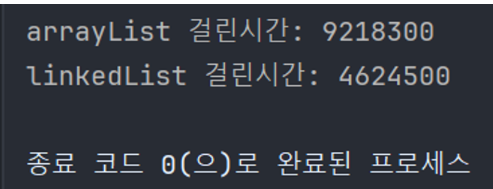

# 컬렉션
## 컬렉션(Collection)

요소를 수집해서 저장하는 것

여러 객체를 저장하고 필요할 때마다 꺼내서 이용할 때 배열을 이용해왔음

아래처럼 배열을 이용해 객체를 쉽게 생성하고 이용할 수 있지만 객체를 삭제 하였을 때 인덱스 값이 듬성듬성 존재하게 됨. 따라서 만약 새로운 객체를 추가한다고 하면 인덱스 값의 존재를 확인하는 과정을 따로 거쳐야 함.

```java
// 배열 생성
Product[] products = new Product[5];

// 객체 저장
products[0] = new Product("상품 1");
products[1] = new Product("상품 2");
products[2] = new Product("상품 3");

// 객체 가져오기
System.out.println(products[0]);
System.out.println(products[0]);
System.out.println(products[0]);

// 객체 삭제
products[0] = null;
products[1] = null;
products[2] = null;
```

이러한 점을 개선하기 위해 자바에 컬렉션과 관련된 인터페이스와 클래스들이 나왔고 이들을 **컬렉션**이라고 함

주요 컬렉션 인터페이스

- List 인터페이스
    - 구현 클래스로 ArrayList, LinkedList 등 있음
    - 자료 순서를 유지하고 저장하며 중복 저장 가능
- Set 인터페이스
    - 구현 클래스로 HashSet 등 있음
    - 자료 순서를 유지하지 않고 저장하며 중복 저장 불가
- Map 인터페이스
    - 구현 클래스로 HashMap, Hashtable 등 있음
    - 키와 값의 쌍으로 저장하며 키는 중복 저장 불가


## List

- 배열처럼 객체를 일렬로 늘어놓은 구조
- 배열은 선언 시점에 자료형 크기를 결정하면 수정을 못하지만 List 컬렉션은 자료형 크기를 수정할 수 있음
- List 컬렉션은 객체 자체를 저장하는 것이 아닌 객체의 번지를 참조

### List 인터페이스의 메서드

- `boolean add(E e)`: 주어진 객체를 맨 끝에 추가
- `void add(int index, E element)`: 주어진 인덱스에 객체 추가
- `set(int index, E element)`: 주어진 인덱스에 저장된 객체를 주어진 객체로 바꿈

- `boolean contains(Object o)`: 주어진 객체가 저장되어있는지 여부
- `E get(int index)`: 주어진 인덱스에 저장된 객체를 리턴
- `isEmpty()`: 컬렉션이 비어있는지 여부
- `int size()`: 저장되어 있는 전체 객체 수 리턴

- `void clear()`: 저장된 모든 객체를 삭제
- `E remove(int index)`: 주어진 인덱스에 저장된 객체 삭제
- `boolean remove(Object o)`: 주어진 객체를 삭제

### ArrayList

List 인터페이스의 구현 클래스

객체가 추가되면 인덱스로 관리

배열과 달리 저장 용량을 초과한 객체들이 들어오면 자동적으로 저장 용량이 늘어남

기본 구조

```java
// E 객체 10개를 저장할 수 있는 초기 용량을 가짐
List<E> list = new ArrayList<>(초기 용량 지정);
```

ArrayList에 객체를 추가하면 인덱스 0부터 차례대로 저장

특정 인덱스의 객체를 제거하면 그 뒤의 인덱스들 모두 앞으로 1씩 당겨짐

반대로 특정 인덱스에 객체를 삽입하면 뒤의 인덱스들 모두 뒤로 1씩 밀림

이 과정에서 리소스 잡아먹으므로 객체 삭제나 삽입이 빈번할 때에는 ArrayList 사용 지양하기

요소를 추가, 삭제, 출력 해보면

```java
List<String> arrayList = new ArrayList<>();
arrayList.add("Java");
arrayList.add("Spring");
arrayList.add("Servlet/JSP");
arrayList.add("DBMS");
arrayList.add("JPA");

for(String str : arrayList){
  System.out.println(str);
}

System.out.println("=================");

arrayList.add(2, "hello");
for(String str : arrayList){
  System.out.println(str);
}

System.out.println("=================");

arrayList.remove(2);
for(String str : arrayList){
  System.out.println(str);
}
```

```
실행 결과

=================
Java
Spring
Servlet/JSP
DBMS
JPA
=================
Java
Spring
hello
Servlet/JSP
DBMS
JPA
=================
Java
Spring
Servlet/JSP
DBMS
JPA
```


### LinkedList

List의 구현 클래스

LinkedList는 인접 참조를 링크해서 체인처럼 관리

따라서 특정 인덱스의 객체를 제거하거나 삽입할 때 앞뒤 링크만 변경되고 나머지 링크는 그대로 유지

LinkedList의 기본 구조

```java
// 처음 생성할 때 링크가 없으므로 내부는 비어있음
List<E> list = new LinkedList<>();
```

### ArrayList와 LinkedList 비교

- ArrayList는 객체들이 각자 방에 있다가 객체가 삽입되거나 삭제될 때 뒤의 객체들이 각자 방 빼서 옮기는 느낌
- LinkedList는 객체들이  줄 지어 옆의 객체들이랑 손 잡고 있다가 객체가 삽입되거나 삭제될 때 해당 주변 객체들이 잡던 손 놓고 다른 객체랑 손 잡는 느낌

ArrayList와 LinkedList에 10,000개의 객체를 삽입하는 데 걸린 시간을 측정

```java
List<String> arrayList = new ArrayList<>();
List<String> linkedList = new LinkedList<>();

long startTime, endTime;
startTime = System.nanoTime();
for (int i = 0; i < 10000; i++) {
  arrayList.add(0, String.valueOf(i));
}
endTime = System.nanoTime();
System.out.println("arrayList 걸린시간: " + (endTime - startTime));

startTime = System.nanoTime();
for (int i = 0; i < 10000; i++) {
  linkedList.add(0, String.valueOf(i));
}
endTime = System.nanoTime();
System.out.println("linkedList 걸린시간: " + (endTime - startTime));
```

엄청 차이남



## Set

- List 컬렉션과 다르게 Set 컬렉션은 저장 순서가 유지되지 않음
- 객체를 중복 저장할 수 없음
- 저장 순서가 유지되지 않아 인덱싱 X

### Set 인터페이스의 메서드

- `boolean add(E e)`: 주어진 객체 저장, 성공적으로 저장되면 true 리턴하고 중복 객체면 false 리턴

- `boolean contains(Object o)`: 주어진 객체가 저장되어 있는지 여부
- `isEmpty()`: 컬렉션이 비어있는지 조사
- `Iterator<E> iterator()`: 저장된 객체를 한 번씩 가져오는 반복자 리턴
- `int size()`: 저장되어 있는 전체 객체 수 리턴

- `void clear()`: 저장된 모든 객체 삭제
- `boolean remove(Object o)`: 주어진 객체 삭제


### Iterator 인터페이스의 메서드

- `hasNext()`: 가져올 객체가 있으면 true 리턴, 없으면 false 리턴
- `next()`: 컬렉션에서 하나의 객체를 가져옴
- `remove()`: Set 컬렉션에서 객체 제거

```java
Set<String> set = ...;

Iterator<String> iterator = set.iterator();
while (iterator.hasNext()) { // 저장된 객체 수 만큼 반복함
	String str = iterator.next(); // 객체 하나씩 가져옴
}
```

향상된 for문으로 전체 객체를 대상으로 반복 가능

```java
Set<String> set = ...;
for(String str : set) {

}
```

Set 컬렉션에서 Iterator의 next() 메서드로 가져온 객체를 제거하려면 remove() 메서드 사용

```java
Set<String> set = ...;
Iterator<String> iterator = set.iterator();
while (iterator.hasNext()) { // 저장된 객체 수만큼 반복
	iterator.remove(); // 삭제
}
```


### HashSet

Set 인터페이스의 구현 클래스

HashSet 생성은 기본 생성자 호출하면 됨

```java
Set<E> set = new HashSet<>();
```

Set 컬렉션이므로 HashSet 역시 객체들을 순서 없이 저장하고 중복 저장 불가능함

동일한 객체를 판별하기 위해서 객체 저장하기 전에 객체의 hashCode() 메서드를 호출해 해시코드를 얻어냄

얻은 해시코드와 이미 저장되어있는 객체들의 해시코드와 비교해 동일한 해시코드가 나오면 다시 equals() 메서드로 두 객체를 비교

여기서 true가 나오면 동일한 객체로 판별하여 저장 X

HashSet에 객체를 추가, 검색, 제거해보자

```java
// HashSet 생성
Set<Integer> integerSet = new HashSet<>();

// 객체 추가
integerSet.add(1);
integerSet.add(2);
integerSet.add(3);
integerSet.add(4);
integerSet.add(5);

// 검색을 위한 반복자 얻기
Iterator<Integer> iterator = integerSet.iterator();

// 저장되어있는 객체 출력
while(iterator.hasNext()){
  System.out.println(iterator.next());
}

System.out.println("===================");

// 저장된 객체 수 출력
System.out.println(integerSet.size());

System.out.println("===================");

// 객체 삭제
integerSet.remove(2); // 삭제
iterator = integerSet.iterator(); // iterator 다시 선언하기!!

while(iterator.hasNext()){
  System.out.println(iterator.next());
}
```

```
실행 결과

1
2
3
4
5
===================
5
===================
1
3
4
5
```

```java
Set<String> stringSet = new HashSet<>();

stringSet.add("Java");
stringSet.add("Spring");
stringSet.add("JSP");
stringSet.add("Java"); // 중복되어 저장X
stringSet.add("DBMS");

System.out.println(stringSet.size()); // 4 출력

System.out.println("==================");

Iterator<String> iterator = stringSet.iterator();
while(iterator.hasNext()){
  System.out.println(iterator.next());
}

System.out.println("==================");

stringSet.remove("Java"); // 자바 제거

iterator = stringSet.iterator();
while(iterator.hasNext()){
  System.out.println(iterator.next());
}

System.out.println("==================");

if (stringSet.isEmpty()){
  System.out.println("비었습니다.");
}else{
  System.out.println("비지 않았습니다.");
}
```

```
4
==================
Java
JSP
DBMS
Spring
==================
JSP
DBMS
Spring
==================
비지 않았습니다.
```

데이터 내용은 같지만 인스턴스가 달라 객체 둘 다 저장 

```java
Set<Member> set = new HashSet<>();

set.add(new Member("홍길동", 30));
set.add(new Member("홍길동", 30));

System.out.println("총 객체 수 : " + set.size());
```

이 때 중복처리 하도록 만들기 위해서는 Member 클래스에서 hashCode()와 equals() 메서드 오버라이딩 하여 데이터 값이 동일할 때 동일한 객체로 간주하도록 함

```java
public class Member {
  private String name;
  private int age;

  public Member(String name, int age) {
    this.name = name;
    this.age = age;
  }

  @Override
  public boolean equals(Object o) {
    if (o instanceof Member) {
      Member member = (Member) o;
      return member.name.equals(this.name) && member.age == this.age;
    } else {
      return false;
    }
  }

  @Override
  public int hashCode() {
    int i = name.hashCode();
    System.out.println(i);
    return i;
  }
}
```

name 값의 hashCode를 반환하도록 오버라이딩

매개값이 Member 객체의 인스턴스면 매개값을 Member 타입으로 형변환 후 저장되어있는 데이터와 이름이 같고, 나이도 같을 때 true 반환하도록 오버라이딩

```
실행 결과

54150062
54150062
총 객체 수 : 1
```


## Map
- Map 컬렉션은 키와 값의 쌍으로 구성된 객체를 저장
- 여기서 키와 값은 모두 객체
- 키는 중복 X, 값은 중복 가능
- 기존에 저장된 키 값과 동일한 키 값으로 저장하면 기존의 키 값은 사라지고 새로운 값으로 대치

### Map 인터페이스 메서드

Key로 객체들을 관리하므로 Key 값을 매개값으로 갖는 메서드들이 많음

- `V put(K key, V value)`: 주어진 key와 value 추가, 저장되면 value를 리턴

- `boolean containsKey(Object key)`: 주어진 키가 있는지 여부
- `boolean containsValue(Object value)`: 주어진 value가 있는지 여부
- `Set(Map.Entry<K,V>> entrySet()`: 키와 값의 쌍으로 구성된 모든 Map.Entry 객체를 Set에 담아서 리턴
- `V get(Object key)`: 주어진 키가 있는 value를 리턴
- `boolean isEmpty()`: 컬렉션이 비어 있는지 여부
- `Set<K> keySet()`: 모든 키를 Set 객체에 담아 리턴
- `int size()`: 저장된 키의 총 개수 리턴
- `Collection<V> values()`: 저장된 모든 value를 Collection에 담아 리턴

- `vold clear()`: 모든 Map.Entry(키와 값) 삭제
- `V remove(Object key)`: 주어진 키와 일치하는 Map.Entry 삭제하고 value 리턴

```java
Map<String, Integer> map = ...;
map.put("홍길동", 14); // 객체 추가
int age = map.get("홍길동"); // 객체 찾기
map.remove("홍길동"); // 객체 삭제, 14 리턴
```

저장된 객체 모두 하나씩 얻을 때

keySet() 메서드로 **모든 키를 Set 컬렉션으로** 얻은 후, 반복자를 통해 키를 하나씩 얻고 get() 메서드로 value를 얻음

```java
Map<K,V> map = ... ;
Set<K> keySet = map.keySet();
Iterator<K> keyIterator = keySet.iterator();
while(keyIterator.hasNext()){
	K key = keyIterator.Next();
	V value = map.get(key);
}
```

entrySet() 메서드로 **모든 Map.Entry를 Set 컬렉션으로** 얻은 뒤, 반복자를 통해  Map.Entry를 하나씩 얻어 getKey()와 getValue() 메서드로 키와 값을 얻음

```java
Set<Map.Entry<String, Object>> entries = map.entrySet();
for (Map.Entry<String, Object> entry : entries) {
	String key = entry.getKey();
	Object value = entry.getValue();
}
```

### HashMap

Map 인터페이스를 구현한 컬렉션

HashMap 생성은 키 타입과 값 타입을 파라미터로 줘 기본 생성자 호출하기

키와 값 타입은 원시 타입은 사용할 수 없고 클래스 및 인터페이스 타입만 가능

```java
Map<K, Y> map = new HashMap<>();
```

### HashMap 구현

학생 객체를 Key, 점수를 Value로 저장하기

```java
// HashMap 생성, Key 타입은 Student, Value 타입은 Integer
Map<Student, Integer> map = new HashMap<>();

// put() 메서드로 키, 값 추가
map.put(new Student(1, "김기역"), 50);
map.put(new Student(2, "김니은"), 64);
map.put(new Student(3, "김삿갓"), 88);

// 객체를 하나씩 처리하기 위해 entrySet() 메서드 이용
Set<Entry<Student, Integer>> entries = map.entrySet();

// 객체를 하나씩 처리
for (Entry<Student, Integer> entry:entries){
  String student = entry.getKey().getName();
  int no = entry.getKey().getNo();
  Integer score = entry.getValue();
  System.out.println("번호: " + no + " 이름: " + student + " 점수: " + score);
}
```

```
실행 결과

번호: 2 이름: 김니은 점수: 64
번호: 3 이름: 김삿갓 점수: 88
번호: 1 이름: 김기역 점수: 50
```

문자열 타입 키와 문자열 List 타입 Value 저장

```java
Map<String, List<String>> map = new HashMap<>();
List<String> stringList = new ArrayList<>();

// 키, 값 추가
map.put("홍길동", stringList);
stringList.add("홍길동"); // List에 요소 추가
stringList.add("홍길동");
stringList.add("홍길동");

// 갱신
map.put("홍길동", stringList); // 같은 키에 값을 넣으면 덮어쓰기 됨

// Map.EntrySet 얻기
Set<Entry<String, List<String>>> entries = map.entrySet();

// 하나씩 처리
for(Entry<String,List<String>> entry:entries){
  String key = entry.getKey();
  List<String> value = entry.getValue();
  System.out.println(key);
  System.out.println("=====");
  System.out.println(value);
}
```

```
실행 결과

홍길동
=====
[홍길동, 홍길동, 홍길동]
```


### Hashtable

HashMap과 동일한 내부 구조를 가짐

동기화된 메서드로 구성되어 있어 멀티 스레드가 동시에 이 메서드를 실행할 수 없고, 하나의 스레드가 실행을 완료해야 다른 스레드를 실행할 수 있음 

따라서 멀테 스레드 환경에서 데이터의 안전한 처리 가능(thread safe)

생성 방법

```java
Map<K, V> map = new Hashtable<>();
```

### 로그인 로직 구현

입력 받은 아이디와 비밀번호가 Hashtable에 존재 하면 로그인 성공! 없으면 실패!

```java
Map<String, String> map = new Hashtable<>();
Scanner scanner = new Scanner(System.in);

// Hashtable에 로그인 정보 입력
map.put("spring", "qwer");
map.put("summer", "qwer1234");
map.put("fall", "qwer123");
map.put("winter", "qwer123");

while(true){
  System.out.println("아이디와 비밀번호를 입력해주세요");
  System.out.println("아이디: ");
  String id = scanner.nextLine();

  System.out.println("비밀번호: ");
  String pw = scanner.nextLine();

  System.out.println("===================");

  if (map.containsKey(id)){ // 입력한 id가 map에 있는지 확인
    String mapPassword = map.get(id); // 입력한 id에 따른 value값 찾아내기
    if (mapPassword.equals(pw)){ // 입력한 pw와 같은지 확인
      System.out.println("로그인에 성공했습니다.");
      scanner.close();
      break;
    } else {
      System.out.println("비밀번호가 틀렸습니다.");
    }

  } else {
    System.out.println("입력하신 아이디가 존재하지 않습니다.");
  }
  
}
```

```
실행 결과

아이디와 비밀번호를 입력해주세요
아이디:
spring
비밀번호:
qwer
===================
로그인에 성공했습니다.
```